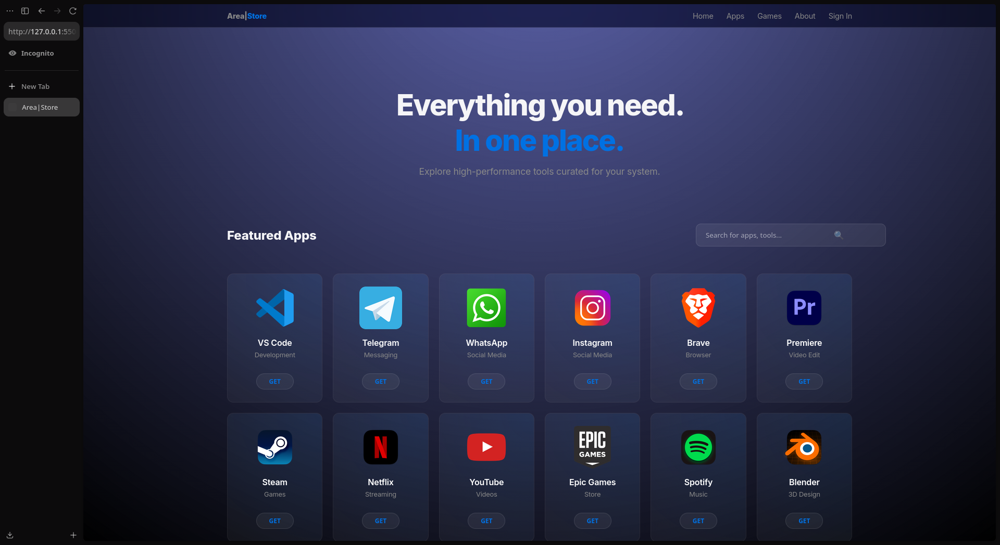
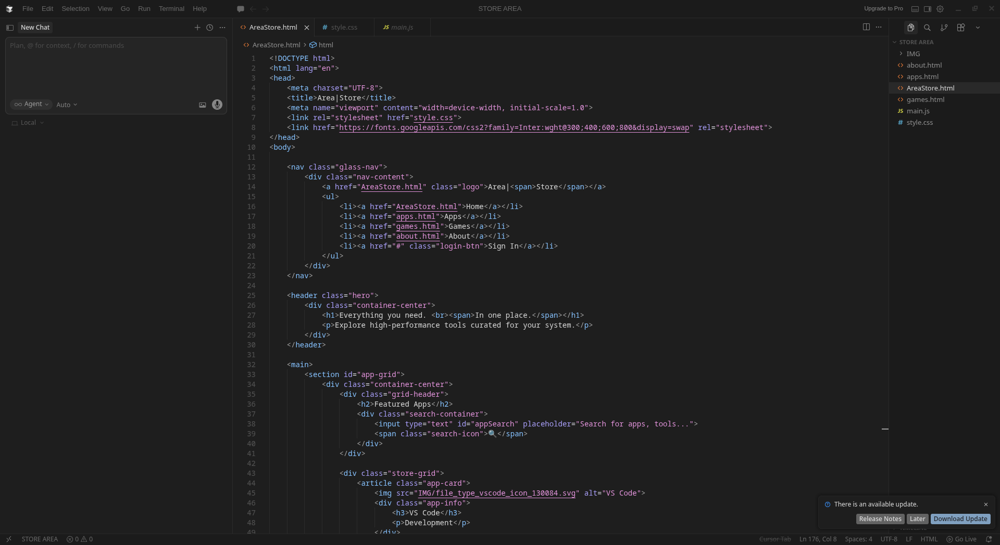
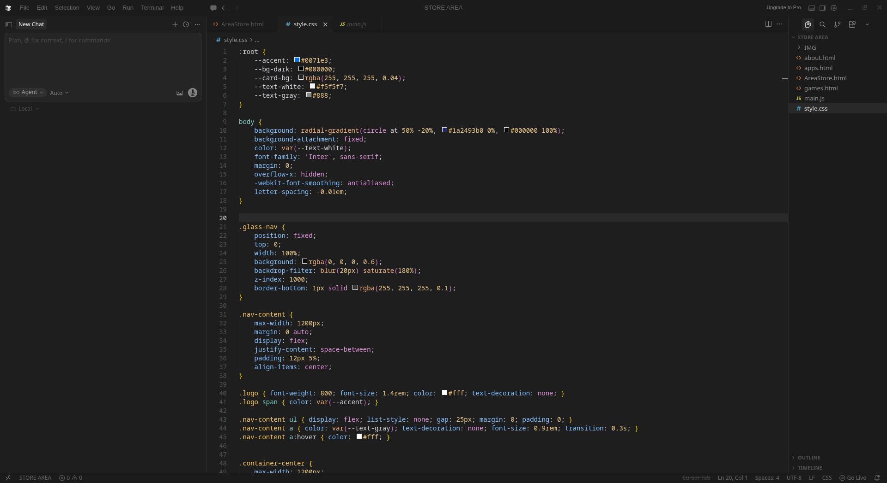

# 🚀 Area Store (Full-stack Project)

> "Performance-driven design, built from the ground up."

### 📱 Preview

### 🏗️ Project Status
- **Progress:** 70% Complete
- **Estimated Launch:** In 3 months
- **Environment:** Developed on Arch Linux (CachyOS)

### 🛠️ Tech Stack
- **Languages:** HTML5, CSS3,  JavaScript
- **Features:** Glassmorphism UI, Responsive Layout, Performance Optimized

---
### 💻 Development Screenshots

---
*Created by **Rayan Elmesbahi** | Junior IT Expert 🎭*
